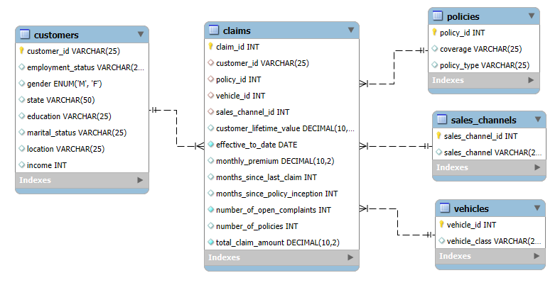
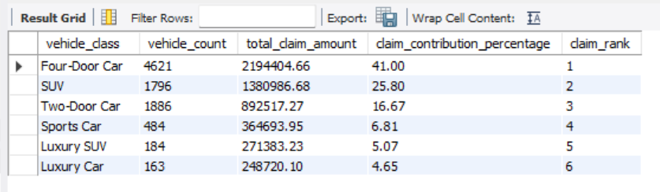
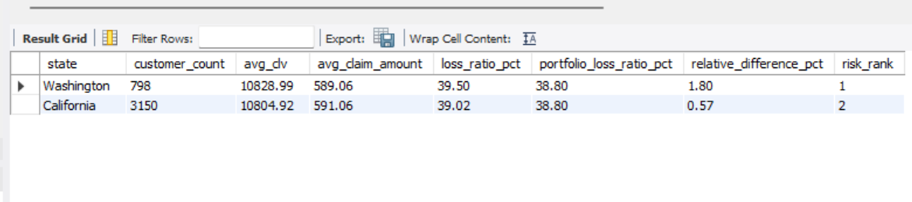
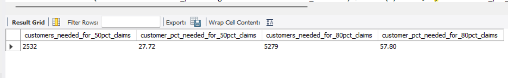
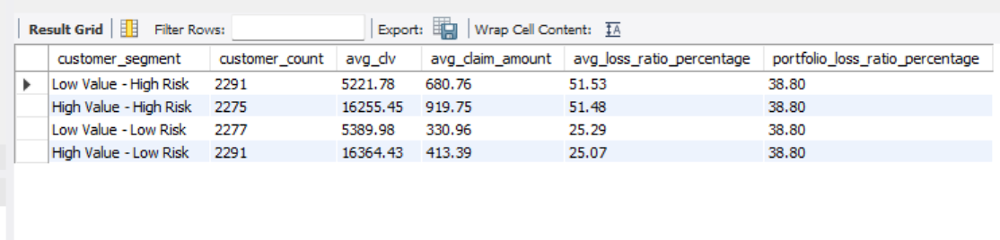
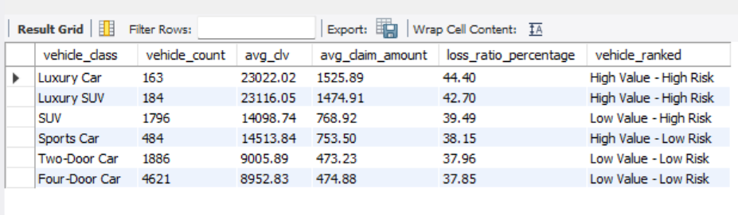

# Motor Claims Analysis - MySQL

## Overview
This project analyzes motor insurance claims using MySQL to identify customer risk patterns, claim severity, policy performance, sales channel performance, and vehicle-level risk.

The analysis progresses from exploratory data analysis to business questions, advanced SQL analysis, and business recommendations.

## Business Objectives
- Identify customer segments associated with higher claim costs.
- Analyze claim severity across vehicle classes and policy types.
- Evaluate loss ratios across vehicle and geographic segments.
- Compare sales channels based on customer value and claim performance.
- Identify high-value, high-risk customer segments.
- Assess concentration of claim costs across customers.

## Tools Used
- MySQL 8.0
- MySQL Workbench
- SQL
  
## SQL Skills Demonstrated
**Core SQL**
- Relational data modeling
- Primary and foreign keys
- Fact and dimension tables
- `SELECT`
- `JOIN`
- `GROUP BY`
- `HAVING`
- `CASE`
- Subqueries
- Aggregate functions


**Advanced SQL**
- Common Table Expressions (`CTEs`)
- Window functions
- Ranking
- `NTILE()`
- `RANK()`
- `ROW_NUMBER()`
- Cumulative sums
- Contribution analysis
- Segmentation
- Portfolio benchmarking
- Loss ratio analysis

## Key Business Insights
- Four-Door Cars contributed approximately 41% of total claim costs.
- Luxury Car and Luxury SUV segments showed the highest loss ratios.
- High Value - High Risk customers represented an important value-risk segment.
- Approximately 28% of customers accounted for 50% of total claim costs.
- Washington and California showed loss ratios above the overall portfolio level.

## Recommendations
- Review pricing and underwriting for vehicle classes with elevated loss ratios.
- Investigate High Value - High Risk customers through targeted risk analysis.
- Conduct deeper analysis of customers residing in Washington and California.
- Use risk segmentation rather than applying broad portfolio-wide strategies.

## Limitations
- One record per customer.
- No transaction history available for customer lifetime value analysis.
- No claim occurrence date field for trend analysis.

## Database Schema


## Analysis Workflow
The project is organized into five SQL files:

### 1. Database Creation
Creates the database structure and relational tables.
- [View SQL: Database Creation](sql/01_create_database.sql)

### 2. Exploratory Data Analysis
**Covered:**
- Dataset overview
- Data quality checks
- Customer analysis
- Claim analysis
- Policy analysis
- Vehicle analysis

- [View SQL: Exploratory Data Analysis](sql/02_exploratory_data_analysis.sql)

### 3. Business Questions
**Analyzed:**
- Customer risk segments
- Geographic claim costs
- Income segments
- Customer lifetime value
- Policy performance
- Sales channel performance
- Vehicle class performance
- Cross-dimensional risk patterns

- [View SQL: Business Questions](sql/03_business_questions.sql)

### 4. Advanced SQL Analysis
**Applied:**
- CTEs
- Window functions
- Ranking
- `NTILE()`
- Cumulative contribution analysis
- Loss ratio analysis
- Customer segmentation
- Portfolio benchmarking

- [View SQL: Advanced Analysis](sql/04_advanced_analysis.sql)

### 5. Business Insights
Summarizes the key findings, business recommendations, and analytical limitations identified throughout the analysis.
- [View SQL: Business Insights](sql/05_business_insights.sql)

## Selected Analysis Results






## Project Structure
```text
motor-claims-analysis/
│
├── README.md
│
├── images/
│   ├── database_schema.png
│   ├── vehicle_claim_contribution.png
│   ├── customer_risk_segmentation.png
│   ├── vehicle_risk_segmentation.png
│   ├── state_risk_analysis.png
│   └── claim_concentration.png
│
└── sql/
    ├── 01_create_database.sql
    ├── 02_exploratory_data_analysis.sql
    ├── 03_business_questions.sql
    ├── 04_advanced_analysis.sql
    └── 05_business_insights.sql
